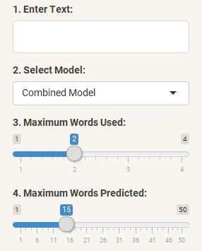
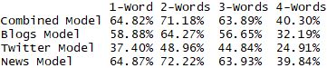

## Text Prediction Shiny Application

### Project

Welcome! 

This application was created for the [Data Science Capstone](https://www.coursera.org/learn/data-science-project/) from Johns Hopkins University and Coursera in cooperation with SwiftKey. The project was to build a shiny application that predicts the next word after a given text input. 

* [Shiny App] (https://crhammond88.shinyapps.io/textprediction/)
* [Slideshow Presentation] (http://rpubs.com/crhammond88/text-prediction)

******

### App

#### Get Started

Enter a text sequence into the empty box on the top-left side of the app and explore the results of the predictions on each of the different tabs. English is the only language supported.

#### Control Panel

The Control Panel allows you to change four variables:

1. The text that will be used to make the predictions.
2. The data model used to make the predictions.
4. The maximum number of words used from the input text to make the predictions.
3. The maximum number of words predicted for each tool.

The Random Word button at the top of the panel will replace the current text entry with a random word chosen from the top 50 most common words in the currently selected data model.

#### Tools

Each tab allows you to explore different aspects of the data models:

#####     Next Word

* Displays the next word predicted, based on the current text input, on the bottom-right of the app. A word cloud displays other 
potential predictions.

#####     More Words

* Press the "Next Words" button to rapidly predict a sequence of words. The button can be pressed repeatedly to continue 
predicting words in the sequence.

#####     Word Suggestion

* Displays a list of words with letter groupings that match the last word entered in the text input. Similar to spellcheck or "Did you mean ________?" features.

******

### Models

There are four data models to explore in the app. Each model was created using the [Capstone Dataset](https://d396qusza40orc.cloudfront.net/dsscapstone/dataset/Coursera-SwiftKey.zip). The data was cleaned and filtered then tokenized into separate grams of one to five words. The frequency of each gram was then calculated to use as a statistical basis for predicting the most likely word in a sequence. 

The combination model was trained using the full english dataset provided. The blogs, news, and twitter models were trained using the full english dataset provided for each respective source.

******

### Prediction Algorithms

The next word prediction algorithm uses one to four words to predict the next word by searching for matching word sequences in the corresponding model. The algorithm will begin by trying to match the longest sequence of words possible, then reduces its search by one word at a time until a match is found. If multiple matches are found with the same number of search words, the match with the highest frequency is then selected as the primary prediciton. If no match is found, the most frequent individual words in the current model are used as a default.

* The word cloud on the 'Next Word' tool will display alternative predictions. 

* The 'More Words' tool randomly selects between the two most likely predictions to avoid prediction loops. 

The predictions from the 'Word Suggestion' tool are based on a similar methodology to the next word prediciton algorithm. In this instance, individual letters are used to find matches by following a backoff process at the beginning and end of the input word. 

******

### Accuracy

An independent dataset of news articles was used for validating the models for a more unbiased result. The results show that predictions are most accurate when using two words to predict a third. 

The context of the source text is also very important to the accuracy of the predictions. The news model achieved the highest performance due to the similarity of writing style in the validation set of news articles. The twitter model performed particularly poorly. The combination model achieved nearly as high of an accuracy rating as the news model, and it's expected to produce the best results across different types of text. 

* [Validation Dataset on Kaggle](https://www.kaggle.com/snapcrack/all-the-news)

******

### Ways to Improve

##### Better Data Cleaning 
* Punctuation can be utilized to improve predictions. Most punctuation was ignored.
* Removing foreign characters and website URLs would reduce noise in the models.
* Twitter data would be more accurate with filtering for hastags and '@' mentions. Special symbols were ignored.

##### Smarter Algorithms
* The models could be structured better for faster indexing to achieve higher prediciton speeds.
* A more sophisticated backoff algorithm could be used to calculate and compare the probability of different results between model sizes.
* The next word algorithm could use the word suggestion algorithm to attempt to find more meaningful results instead of relying on a default prediction.

##### More Data
* Support for additional languages could be added.
* Using larger datasets to build the models may yield higher prediction accuracy. 
* It may be possible to achieve higher accuracy in a specific medium by weighting the data from that source more heavily.